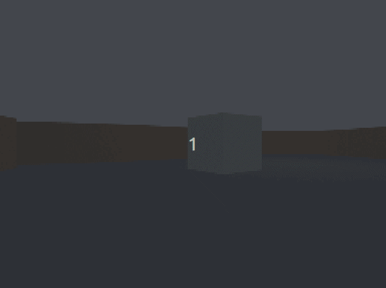

# Machine-Vision

_ENGR3590: A Computational Introduction to Robotics_

_Franklin Noble, Brenna O'Donnell_

### Description: 

Inspired by point-and-click games, we aimed to make a project where a user could click somewhere on the current image from the neato's camera feed, and have the neato follow that object to an arbitrary stopping point. We intended to use openCV to do this and learn about different segmentation algorithms and openCV-ROS2 integration. How our method works, is the user clicks on a location in the most recent image from the Neato's camera. From this click, keypoints are generated on the image within a certain area of the click. The mean of those keypoints is found, which will become the point which the neato will start to turn/drive toward. Once the neato moves a certain amount, new keypoints will be generated evenly across the image and compared to the past ones. Matching points will be kept and used to generate a new mean. This will repeat until the neato is "close enough" to the target object.

## Choosing an algorithm (Design Desicions):
There are MANY ways to segment an image, and throughout this project we checked out or tried a whole bunch of them. 
At first we wanted a click to isolate a section of the image using grap-cut Semantic Segmentation, an algorithm to iteratively select objects based on user-drawn masks. This method took to long to compute a single frame, and did not work very well in the classroom due to all the tables and chairs.
Similar to this was a Click-based Segmentation Implementation from a paper with code in a github repo. This seemed perfect. The user could click in one location and the object the user clicked on would be isolated. THe user could click more times to make the isolated object more accurate. Unfortunately, this repo was made using Python2 and was not viable.
There were also a liteny of semantic segmentation algorithms we found that used Pytorch, which does not play well with ROS2.
We decided on Keypoint Matching with an OpenCV ORB implementation.

## Code Architecture:
This project uses ROS2 in Python with OpenCV for computer vision. ORB is the object detection method.

### Initialization()
This function initializes all the necessary variables and creates a subscription to Image and Bump. It creates a publisher for Twist.

### process_mouse_event()
Processes click events. If the mouse has been clicked, then the image recognition and movement process should begin. This function saves the x,y position of the mouse click to be used later on.

### process_image()
Processes image messages from ROS by assigning the latest image to an attribute called cv_image. In order to emulate the neato framerate, we randomly generate a number 1-10 and if it does not equal 2, we use the frame. This discards 90% of our frames with some irregularity just like a Neato.
```Python
if (random.randint(1,10) != 2):
            return
```
An if-statement check whether the Neato should be moving or not. If the Neato should be moving, the Neato should be keeping track of the current image and the last image it saw.

### process_bump()
This handles the bump subscription which acts as the end condition. If the neato bumps into something, that means it reached the target object (if all goes according to plan).

### Main loop()
Each loop checks if the robot should move. If it should, the following series of functions are called to determine where the robot should go. From this, the physical movement of the Neato is determined and published as a Twist command.

### get_surrounding_keypoints()
Creates a concentric mask around the clicked point and runs ORB using this mask so that the keypoints generate only around the desired object. If no keypoints are found, it just uses the previous set of keypoints and returns the image. Otherwise, it returns image with keypoints drawn

### get_matching_keypoints()
Matches the previous keypoints with the current frame.
```Python
bf = cv2.BFMatcher(cv2.NORM_HAMMING, crossCheck=True)
matches = bf.match(self.descriptors, descriptors_2)
```
This code sorts by smallest Hamming distance, takes 60 best matches, saves matched keypoints to self.keypoints.

### get_mean_of_keypoints()
This function computes a median-MAD filtered centroid. It gets the mean and standard deviation of the points, then uses the Median Absolute Deviation followed by a threshold of 3 to determine which points to keep. The mean of those points is then determined.
```Python
       # median and Median Absolute Deviation
        median = np.median(points_array, axis=0)

        mad = np.median(np.abs(points_array - median), axis=0)
        threshold = 3.0

        #makes boolean array
        mask = np.all(np.abs(points_array - median) / (mad + 1e-6) < threshold, axis=1)

        filtered_points = points_array[mask]
        mean_point = np.mean(filtered_points, axis=0)
        print(mean_point)
        self.center_x = int(mean_point[0])
        self.center_y = int(mean_point[1])
```


## Challenges:
Our first and most pervasive issue was choosing an algorithm. It was extremely time consuming and often demoralizing. We would get attached to a method or algorithm only to find that it wouldn't work for one reason or another. We fully implemented multiple algorithms just for then to not work right for whatever reason. We have also had trouble committing to an alorithm because we got so used to the search-and-fail loop.
Our other major challenge was scheduling. We have rather conflicting schedules which led us to only meeting in class or for multiple hours straight very infrequently. We both had a major obligation for the last 1.5 weeks of the project which vastly limited the time we could work during that period. We tried to deal with this by working a ton on the project right from the outset, meeting as often and as long as we possible could. While we made a great deal of progress before the obligation really started, searching for an algorithm took a lot longer than intended and we had hoped to finish the whole project other than the write up before the other obligation started.

## Improvements:
Our method is not very accurate. It just gets keypoints in the area near a click and does not determine if the keypoints are on the "correct" object and so the neato follows a general area rather than a specific semantic object. We also spent very little time debugging so our project almost certainly does not work quite as intended. There are a few things we could do to improve this. Removing the rotational aspect of the orb keypoints would make the keypoints are more accurate to the scene. Adding an offset based on where the keypoints generate compared to the click to make the keypoints actually generate around the object. Better visualization would let us know what the code is actually doing and aid in debugging. Better "end" detection than just the bump sensor because the can be triggered by running into anything, not just the correct object.
